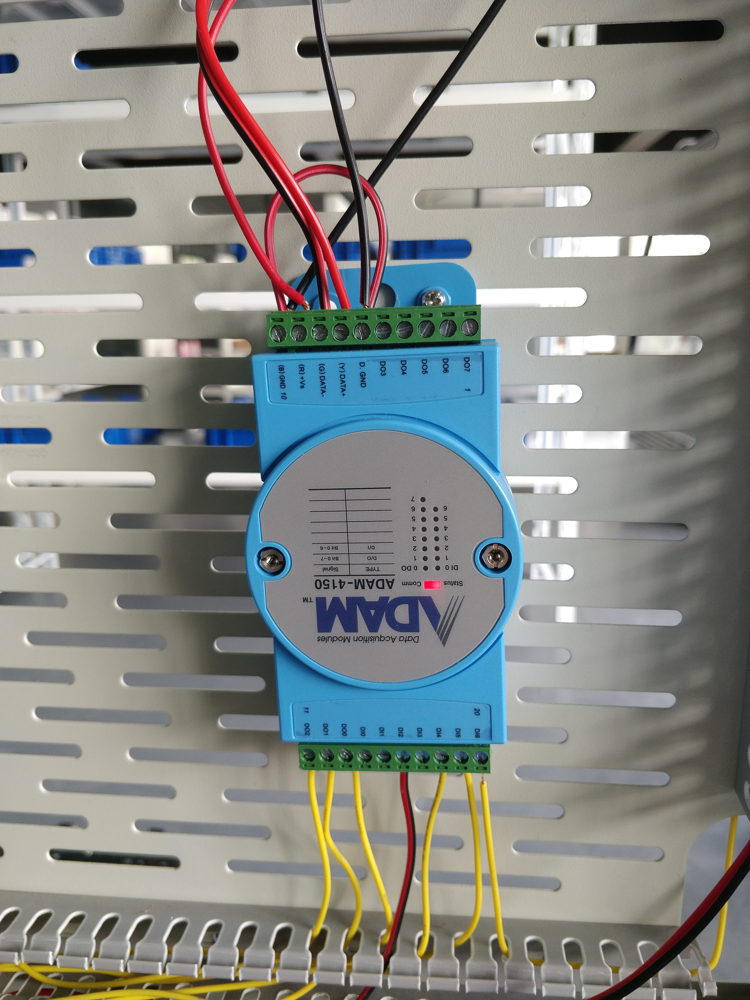
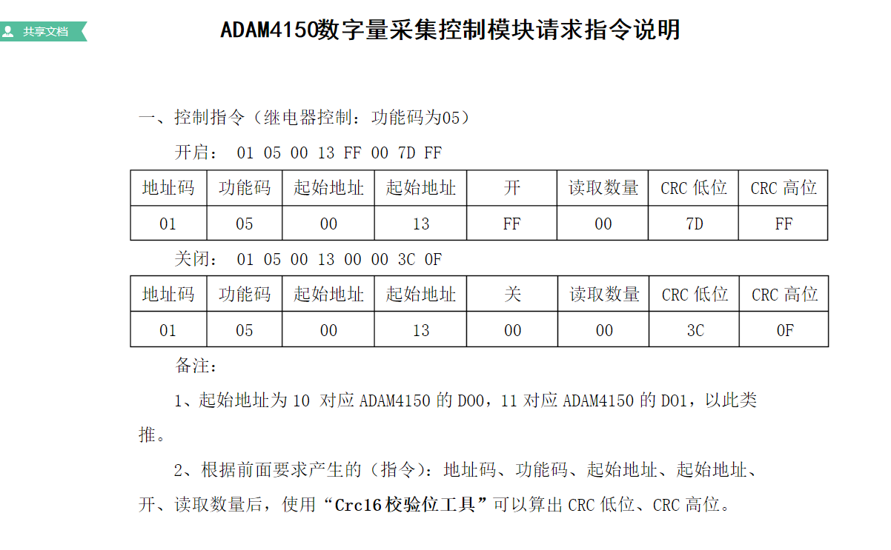
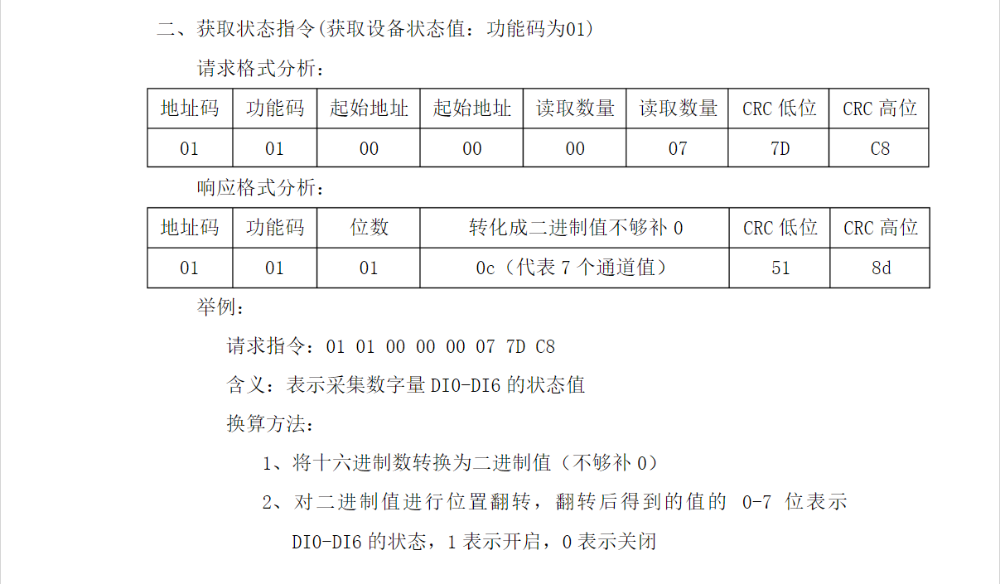
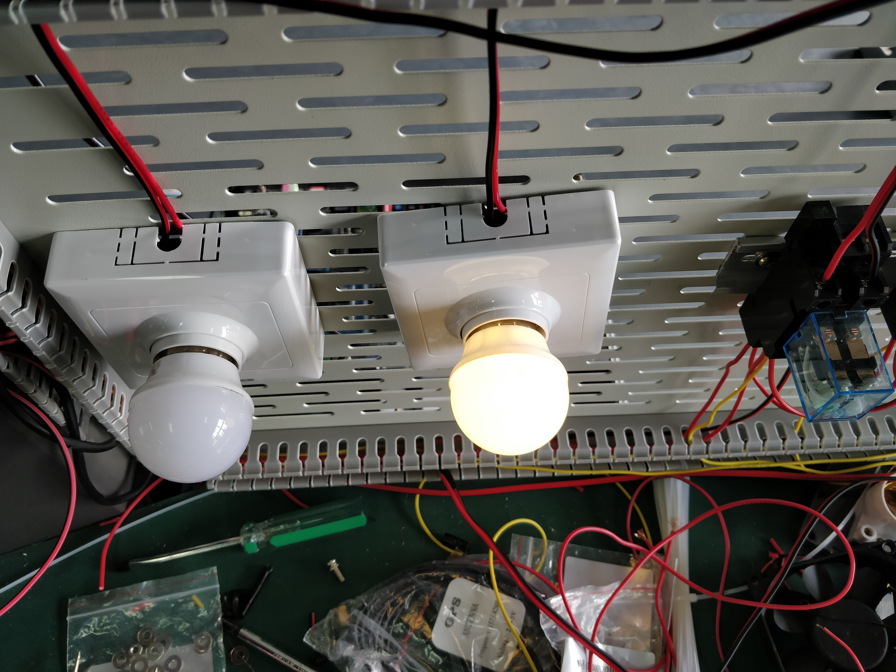

## 【Android开发】基于ADAM4150控制电灯

## 实验目标

通过移动终端开发箱控制电灯开关。


## ADAM-4150数据量采集器

ADAM-4100系列是通用传感器到计算机的便携式接口模块，专为恶劣环境下的可靠操作而设计。该系列产品具有内置的微处理器,坚固的工业级ABS塑料外壳,可以独立提供智能信号调理、模拟量I/O、数字量I/O和LED数据显示，此外地址模式采用了人性化设计，可以方便地读取模块地址。


## 接线问题

将ADAM-4150数据量采集器串口线连接到移动终端开发箱COM2口。

注意：ADAM-4150接线与发送的指令有关，具体看ADAM-4150指令部分。




## ADAM-4150指令






[CRC16校验工具下载地址](http://www.onlinedown.net/soft/973947.htm)

## 步骤

1、新建空白的android程序；

2、导入第三方类库jar文件；

3、编写UI；

4、编写后台代码；

5、通过USB将APK程序复制到移动终端，实现程序控制


## Android代码

### activity_main.xml

```
<RelativeLayout xmlns:android="http://schemas.android.com/apk/res/android"
    xmlns:tools="http://schemas.android.com/tools"
    android:layout_width="match_parent"
    android:layout_height="match_parent"
    android:paddingBottom="@dimen/activity_vertical_margin"
    android:paddingLeft="@dimen/activity_horizontal_margin"
    android:paddingRight="@dimen/activity_horizontal_margin"
    android:paddingTop="@dimen/activity_vertical_margin"
    tools:context="com.admin.MainActivity" >

    <Button
        android:id="@+id/button1"
        android:layout_width="wrap_content"
        android:layout_height="wrap_content"
        android:layout_centerHorizontal="true"
        android:layout_centerVertical="true"
        android:text="开灯" />

    <Button
        android:id="@+id/button2"
        android:layout_width="wrap_content"
        android:layout_height="wrap_content"
        android:layout_below="@+id/button1"
        android:layout_centerHorizontal="true"
        android:layout_marginTop="49dp"
        android:text="关灯" />

</RelativeLayout>

```


### MainActivity.java

```
package com.admin;

import com.example.demo.library.Global;
import com.example.demo.library.ReceiveThread;
import com.newland.jni.Linuxc;

import android.app.Activity;
import android.os.Bundle;
import android.view.Menu;
import android.view.MenuItem;
import android.view.View;
import android.view.View.OnClickListener;
import android.widget.Button;
import android.widget.Toast;

public class MainActivity extends Activity {

	// 路灯开启指令
	private char[] corridorOpenCommand = { 0x01, 0x05, 0x00, 0x11, 0xFF, 0x00,
			0xDC, 0x3F };
	// 路灯关闭指令
	private char[] corridorCloseCommand = { 0x01, 0x05, 0x00, 0x11, 0x00, 0x00,
			0x9D, 0xCF }; 
	private Button mbtnopen;
	private Button mbtnclose;
	@Override
	protected void onCreate(Bundle savedInstanceState) {
		super.onCreate(savedInstanceState);
		setContentView(R.layout.activity_main);
		initView();
		
	}

	@Override
	public boolean onCreateOptionsMenu(Menu menu) {
		// Inflate the menu; this adds items to the action bar if it is present.
		getMenuInflater().inflate(R.menu.main, menu);
		return true;
	}

	@Override
	public boolean onOptionsItemSelected(MenuItem item) {
		// Handle action bar item clicks here. The action bar will
		// automatically handle clicks on the Home/Up button, so long
		// as you specify a parent activity in AndroidManifest.xml.
		int id = item.getItemId();
		if (id == R.id.action_settings) {
			return true;
		}
		return super.onOptionsItemSelected(item);
	}
	public void initView(){
		mbtnopen = (Button)findViewById(R.id.button1);
		mbtnclose =(Button) findViewById(R.id.button2);
		
		mbtnopen.setOnClickListener(new OnClickListener() {
			
			@Override
			public void onClick(View v) {
				openUart();
				sendCMD(corridorOpenCommand);
				
			}
		});
		mbtnclose.setOnClickListener(new OnClickListener() {
			
			@Override
			public void onClick(View v) {
				openUart();
				sendCMD(corridorCloseCommand);
				
			}
		});
		
	}
	private static void sendCMD(char[] cmd) {
		// 将命令转为为String格式用于发送
		String strcmd = String.valueOf(cmd);
		/**
		 * 向硬件发送命令
		 * 
		 * @param fd
		 *            句柄值
		 * @param pBuffer
		 *            字符串
		 * @param Length
		 *            字符长度
		 * @return
		 */
		Linuxc.sendMsgUartHex(Global.com_modbus, strcmd, strcmd.length());
	}

	private void openUart() {
		/**
		 * 打开串口
		 * @arg0:串口 ,1代表com1,2代表com2...等等
		 * @arg1: 接入方式,选择 com口还是usb com是0 usb是1
		 * @return Global.com_modbus 句柄值
		 */
		Global.com_modbus = Linuxc.openUart(2, 0);
		// 如果大于0表示串口打开成，反之失败
		if (Global.com_modbus > 0) {
			/**
			 * 设置波特率
			 * @arg0:句柄值
			 * @arg1:波特率, 1200 --- 0 2400 --- 1 4800 --- 2 9600 --- 3 19200 ---
			 *            4 38400 --- 5 57600 --- 6 115200 ---7 230400 --- 8
			 *            921600 --- 9
			 */
			Linuxc.setUart(Global.com_modbus, 3);
			// 开启接收线程
			ReceiveThread thread = new ReceiveThread();
			// 执行线程
			thread.execute();
		} else {
			//打开失败
			Toast.makeText(MainActivity.this, "串口打开失败", Toast.LENGTH_SHORT)
					.show();
		}
	}
}

```


## 最终效果图

